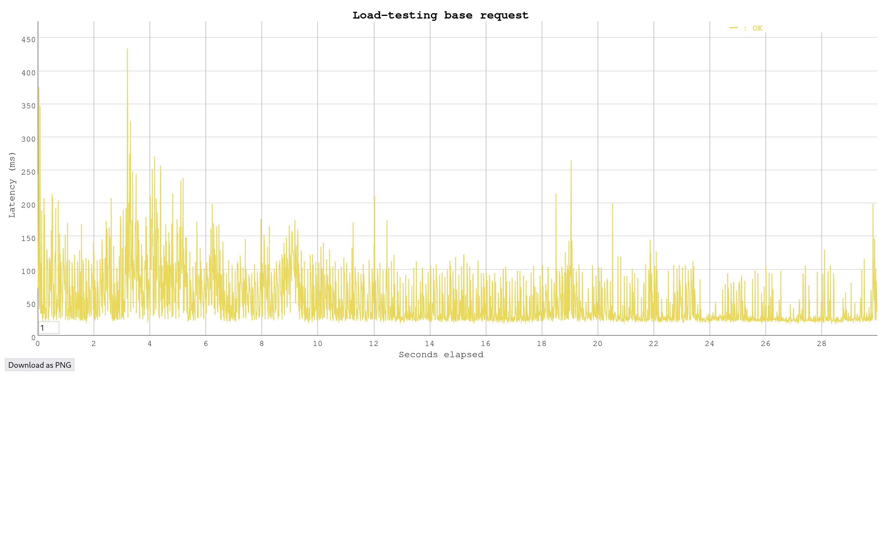

## Task 3: Test the performance of Datastore writes

In this task you will performance test the App Engine platform with a
load generator. You will compare the performance of normal request
processing and request processing that involves Datastore write
operations.

As the Servlets are deployed with Automatic Scaling, there is a danger
of consuming a lot of resources while testing, and burning through a
lot of money. Google gave you a coupon with some money that was put
into a billing account. Projects can have spending limits, but by
default it is unlimited. Before starting the performance test, you
have to set a reasonable daily spending limit.

Set a daily spending limit on the project as follows:

- In the Cloud Platform console navigate to **App Engine** >
  **Settings**. Click on **Edit**. Enter a daily spending limit of
  **$1.00**. (Note: Google has removed this functionality in January 2020. There is no replacement for it yet. Skip this step, but observe how many credits you have left before and after the performance tests. You can also limit the number of instances with an optional configuration of the autoscaling algorithm: In the file `appengine-web.xml` in the `<automatic-scaling>` element add a `<max-instances>` element with a small value (3, 4, ...). See <https://cloud.google.com/appengine/docs/standard/java/config/appref#scaling_elements>. An alternative is to use **Budgets & alerts**. In the Cloud Platform console navigate to **Billing** > **Budgets & alerts**. Create a new budget for the month for an amount of **$1.00** and optionally set the actions associated with the alert.)

Conduct the performance tests as follows:

1. You should already have vegeta installed from previous labs. If not, see <https://blog.absyah.dev/super-simple-guide-for-load-testing-using-vegeta#heading-install-vegeta>.

2. First test the performance of normal request processing using the
   Servlet generated by the wizard.

   - Prepare an "attack" using vegeta.

   - In the App Engine console open the **Dashboard**.

   - Run the attack.

   - In the dashboard observe the graph of the incoming requests, the
     number of instances and the latency.

3. Test the performance of the Servlet that writes to the Datastore.

4. At the end of the tests observe in detail how much resources were
   used. In the console click on **Quota Details**.

5. If you are running out of resources because of the monthly spending
   limit, increase it carefully by a dollar or two.

Deliverables:

- For each performance test, write the command used to generate the attack with vegeta and copy the file generated by the vegeta plot command.

  ```
  # HelloWorld Servlet
  vegeta attack -duration=30s -rate=100 -targets=targets.list | tee results.bin | vegeta report
  ```

  

  ```
  # Datastore write servlet
  vegeta attack -duration=30s -rate=100 -targets=targets.list | tee results.bin | vegeta report 
  ```
   .png)
- What response times do you observe for each Servlet?

> HelloWorld:
```
Latencies     [min, mean, 50, 90, 95, 99, max]  18.103ms, 70.205ms, 29.292ms, 192.41ms, 254.548ms, 427.848ms, 677.305ms
```
> DataStoreWrite: 
```
Latencies     [min, mean, 50, 90, 95, 99, max]  29.159ms, 1.042s, 49.826ms, 4.293s, 5.605s, 7.149s, 7.736s
```

- Compare the response times shown by vegeta with the App Engine
  console. Explain the difference.

  ```
  The latency displayed by the App Engine console only takes into account the latency from the instant the request enters and leaves Google's infrastructure, while the one reported by the local load testing includes the latency implied by the travel time of packets in the network.
  ```

- How many resources have you used to run these tests? From the
  **Quota Details** view of the console determine the non-zero resource
  quotas (**Daily quota** different from 0%). Explain each with a sentence.
  To get a sense of everything that is measured click on **Show resources not in use**.

  - Cloud Firestore API Calls > The calls made to the Datastore api (ready & writes)
  - Cloud firestore stored data > The quantity of data stored in the datastore
  - Data Sent to Cloud Firestore API > Ingress for the datastore api
  -  Data Received from Cloud Firestore API > Egress for the datastore api
  - Cloud Firestore Entity Fetch Ops > Number of fetch requests made to the datastore API
  - Cloud Firestore Entity Writes > Number of writes (not requests) made in the datastore
  - Cloud Firestore Index Write Ops > Number of writes to the indexes of the datastore storage (1 per indexed column per entity)
  
- Let's suppose you become suspicious that the algorithm for the automatic scaling of
  instances is not working correctly. Imagine a way in which the algorithm could be broken. Which measures shown in the console would you use to detect this failure?
  - One good way to check is to compare the number of instances present in the instances tab, and the number of requests present in the dashboard.

## Troubleshooting

If your Servlet that writes to the Datastore works OK on your local
machine, but you get a server error when running it in the Google
cloud, have a look at the logs (hamburger menu > Logs). If you see a
NoClassDefFoundError related to the Datastore you have run into a
[problem that was reported to Google on March 22, 2018](https://issuetracker.google.com/issues/76144204). The
problem is that the library for the Datastore,
`appengine-api-1.0-sdk`, is missing. Previously it was automatically
included by Google.

Here is a workaround:

- Create a new project (Google App Engine Standard Environment) that
  has Maven activated (option on the first screen of the wizard).
- Edit the file `pom.xml`: In the dependency declaration for
  `appengine-api-1.0-sdk` change the scope from `provided` to
  `compile` (this will include the dependency in the jar that is
  uploaded to Google).
- _Clean_ the project.
