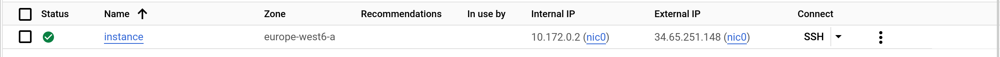

# Task 2: Create a cloud infrastructure on Google Compute Engine with Terraform

In this task you will create a simple cloud infrastructure that consists of a single VM on Google Compute Engine. It will be
managed by Terraform.

This task is highly inspired from the following guide: [Get started with Terraform](https://cloud.google.com/docs/terraform/get-started-with-terraform).

Create a new Google Cloud project. Save the project ID, it will be used later.

- Name: **labgce**

As we want to create a VM, you need to enable the Compute Engine API:

- [Navigate to google enable api page](https://console.cloud.google.com/flows/enableapi?apiid=compute.googleapis.com)


Terraform needs credentials to access the Google Cloud API. Generate and download the Service Account Key:

- Navigate to **IAM & Admin** > **Service Accounts**.
- Click on the default service account > **Keys** and **ADD KEY** > **Create new key** (JSON format).
- On your local machine, create a directory for this lab. In it, create a subdirectory named `credentials` and save the key under the name `labgce-service-account-key.json`, it will be used later.

Generate a public/private SSH key pair that will be used to access the VM and store it in the `credentials` directory:

    ssh-keygen \
      -t ed25519 \
      -f labgce-ssh-key \
      -q \
      -N "" \
      -C ""

At the root of your lab directory, create a `terraform` directory and get the [backend.tf](./appendices/backend.tf), [main.tf](./appendices/main.tf), [outputs.tf](./appendices/outputs.tf) and [variables.tf](./appendices/variables.tf) files.

These files allow you to deploy a VM, except for a missing file, which you have to provide. Your task is to explore the provided files and using the [Terraform documentation](https://www.terraform.io/docs) understand what these files do.

The missing file `terraform.tfvars` is supposed to contain values for variables used in the `main.tf` file. Your task is to find out what these values should be. You can freely choose the user account name and the instance name (only lowercase letters, digits and hyphen allowed).

You should have a file structure like this:

    .
    ├── credentials
    │   ├── labgce-service-account-key.json
    │   ├── labgce-ssh-key
    │   └── labgce-ssh-key.pub
    └── terraform
        ├── backend.tf
        ├── main.tf
        ├── outputs.tf
        ├── terraform.tfvars
        └── variables.tf

There are two differences between Google Cloud and AWS that you should know about:

1. Concerning the default Linux system user account created on a VM: In AWS, newly created VMs have a user account that is always named the same for a given OS. For example, Ubuntu VMs have always have a user account named `ubuntu`, CentOS VMs always have a user account named `ec2-user`, and so on. In Google Cloud, the administrator can freely choose the name of the user account.

2. Concerning the public/private key pair used to secure access to the VM: In AWS you create the key pair in AWS and then download the private key. In Google Cloud you create the key pair on your local machine and upload the public key to Google Cloud.

The two preceding parameters are configured in Terraform in the `metadata` section of the `google_compute_instance` resource description. For example, a user account named `fred` with a public key file located at `/path/to/file.pub` is configured as

    metadata = {
      ssh-keys = "fred:${file("/path/to/file.pub")}"
    }

This is already taken care of in the provided `main.tf` file.

You can now initialize the Terraform state:

    cd terraform
    terraform init

[OUTPUT]

```bash
Initializing the backend...

Successfully configured the backend "local"! Terraform will automatically
use this backend unless the backend configuration changes.

Initializing provider plugins...
- Finding latest version of hashicorp/google...
- Installing hashicorp/google v5.30.0...
- Installed hashicorp/google v5.30.0 (signed by HashiCorp)

Terraform has created a lock file .terraform.lock.hcl to record the provider
selections it made above. Include this file in your version control repository
so that Terraform can guarantee to make the same selections by default when
you run "terraform init" in the future.

Terraform has been successfully initialized!

...
```

- What files were created in the `terraform` directory? Make sure to look also at hidden files and directories (`ls -a`).

[OUTPUT]

```bash
.terraform
.terraform.lock.hcl
```

- What are they used for?

| File/FolderName     | Explanation                                                         |
| :------------------ | :------------------------------------------------------------------ |
| .terraform          | Holds the terraform state and the providers used                    |
| .terraform.lock.hcl | Contains the version of the providers used. E.g. `hashicorp/google` |

- Check that your Terraform configuration is valid:

```bash
terraform validate
```

[OUTPUT]

```bash
Success! The configuration is valid.
```

- Create an execution plan to preview the changes that will be made to your infrastructure and save it locally:

```bash
terraform plan -input=false -out=.terraform/plan.cache
```

- If satisfied with your execution plan, apply it:

```bash
terraform apply -input=false .terraform/plan.cache
```

- Test access via ssh

[INPUT]

```bash
ssh user@34.65.251.148 -i ./credentials/labgce-ssh-key
```

[OUTPUT]

```
The authenticity of host '34.65.251.148 (34.65.251.148)' can't be established.
ED25519 key fingerprint is SHA256:Fy2FHipaMcAXutb6PIv7QKu36heEgxeL0ighwSDpLKs.
This key is not known by any other names
Are you sure you want to continue connecting (yes/no/[fingerprint])? yes
Warning: Permanently added '34.65.251.148' (ED25519) to the list of known hosts.
Welcome to Ubuntu 20.04.6 LTS (GNU/Linux 5.15.0-1060-gcp x86_64)

...
```

If no errors occur, you have successfully managed to create a VM on Google Cloud using Terraform. You should see the IP of the Google Compute instance in the console. Save the instance IP, it will be used later.

After launching make sure you can SSH into the VM using your private
key and the Linux system user account name defined in the `terraform.tfvars` file.

Deliverables:

- Explain the usage of each provided file and its contents by directly adding comments in the file as needed (we must ensure that you understood what you have done). In the file `variables.tf` fill the missing documentation parts and link to the online documentation. Copy the modified files to the report.

- Explain what the files created by Terraform are used for.

- Where is the Terraform state saved? Imagine you are working in a team and the other team members want to use Terraform, too, to manage the cloud infrastructure. Do you see any problems with this? Explain.

```
The terraform state is saved in terraform.tfstate.

The problem that could arrise is that mulitple member of a team could update the state of the resources at the same time.
```

- What happens if you reapply the configuration (1) without changing `main.tf` (2) with a change in `main.tf`? Do you see any changes in Terraform's output? Why? Can you think of examples where Terraform needs to delete parts of the infrastructure to be able to reconfigure it?

```
1. If we try to reapply the plan, we get a message: "No changes. Your infrastructure matches the configuration."
2. The changes are applied, terraform will either try to update-in-place or recreate the resource, depending on the attribute that changed.
```

- Explain what you would need to do to manage multiple instances.

```
You can add a `count` attribute to the `google_compute_instance` resource.
```

- Take a screenshot of the Google Cloud Console showing your Google Compute instance and put it in the report.



- Deliver a folder "terraform" with your configuration.
